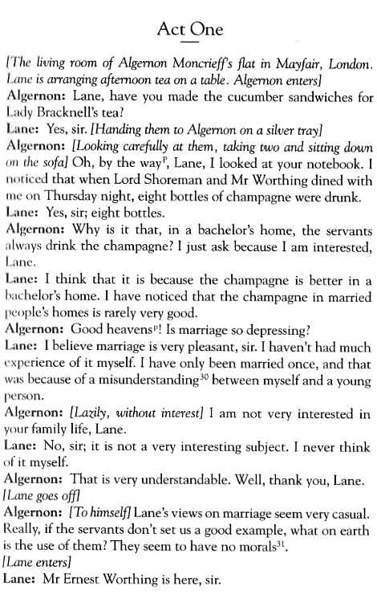
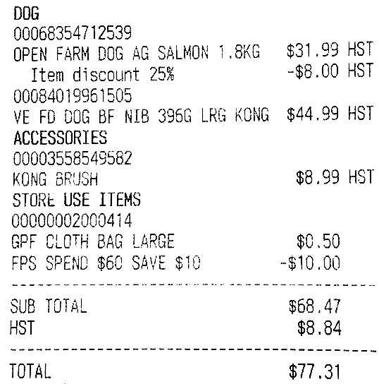

```{r, echo = FALSE, message = FALSE}
library(tibble)
# knitr::opts_chunk$set(comment = "")
has_chi_sim <- "chi_sim" %in% readpdf::tesseract_info()$available
if (identical(Sys.info()[["user"]], "pacha")) stopifnot(has_chi_sim)
if (grepl("tesseract.Rcheck", getwd())) {
  Sys.sleep(10) # workaround for CPU time check
}
```

The tesseract package provides R bindings [Tesseract](https://github.com/tesseract-ocr/tesseract): a powerful optical character recognition (OCR) engine that supports over 100 languages. The engine is highly configurable in order to tune the detection algorithms and obtain the best possible results.

Keep in mind that OCR (pattern recognition in general) is a very difficult problem for computers. Results will rarely be perfect and the accuracy rapidly decreases with the quality of the input image. But if you can get your input images to reasonable quality, Tesseract can often help to extract most of the text from the image.

## Extract Text from PDF

OCR is the process of finding and recognizing text inside images, for example from a screenshot, scanned paper. The image below has some example text:



The `ocr()` function extracts text from an image file. After indicating the engine for the language, it will return the text found in the image:

```{r}
library(readpdf)
file <- system.file("examples", "oscarwilde.pdf", package = "readpdf")
eng <- tesseract("eng")
text <- ocr(file, engine = eng)
cat(text)
```

## Language Data

The tesseract OCR engine uses language-specific training data in the recognize words. The OCR algorithms bias towards words and sentences that frequently appear together in a given language, just like the human brain does. Therefore the most accurate results will be obtained when using training data in the correct language. 

Use `tesseract_info()` to list the languages that you currently have installed.

```{r}
tesseract_info()
```

By default the R package only includes English training data. Windows and Mac users can install additional training data using `tesseract_download()`. Let's OCR a screenshot from Wikipedia in Simplified Chinese.


```{r, eval=FALSE}
# Only need to do download once:
tesseract_download("chi_sim")
```

```{r eval = has_chi_sim}
# Now load the dictionary
(simplified_chinese <- tesseract("chi_sim"))
file <- system.file("examples", "chinese.pdf", package = "readpdf")
text <- ocr(file, engine = simplified_chinese)
cat(text)
```

Compare with the copy and paste from the Wikipedia.

```{r}
text2 <- readLines(
  system.file("examples", "chinese.txt", package = "readpdf")
)

cat(text2)
```

## Setting the number of pages

If your PDF file has more than one page, you can specify the page number to extract the text from. For example, the following code extracts the text from the second page of the PDF file.


```{r, eval=require(magick)}
file <- system.file("examples", "bondargentina.pdf", package = "readpdf")
text <- ocr(file, pages = 2, engine = eng)
cat(text)
```

If the page is not specified, the function will return a vector with the text found in each page.

```{r}
cat(ocr(file, engine = eng))
```

## Tesseract Control Parameters

Tesseract supports hundreds of "control parameters" which alter the OCR engine. Use `tesseract_params()` to list all parameters with their default value and a brief description. It also has a handy `filter` argument to quickly find parameters that match a particular string.

```{r}
# List all parameters with *colour* in name or description
tesseract_params("colour")
```

Do note that some of the control parameters have changed between Tesseract engine 3 and 4.

```{r}
tesseract_info()["version"]
```

### Whitelist / Blacklist characters

One powerful parameter is `tessedit_char_whitelist` which restricts the output to a limited set of characters. This may be useful for reading for example numbers such as a bank account, zip code, or gas meter.

The whitelist parameter works for all versions of Tesseract engine 3 and also engine versions 4.1 and higher, but unfortunately it did not work in Tesseract 4.0.



```{r}
file <- system.file("examples", "mrdukeexpenditure.pdf", package = "readpdf")
numbers <- tesseract(options = list(tessedit_char_whitelist = "-$.0123456789"))
cat(ocr(file, engine = numbers))
```

To test if this actually works, look at the output without the whitelist:

```{r}
cat(ocr(file, engine = eng))
```

As an Easter egg, this is Mr. Duke:


## Best versus Fast models

In order to improve the OCR results, Tesseract has two variants of models that can be used. The `tesseract_download()` can download the 'best' (but slower) model, which increases the accuracy. The 'fast' (but less accurate) model is the default.

```{r, eval = FALSE}
file <- system.file("examples", "chinese.pdf", package = "readpdf")

# download the best model (vertical script download is to avoid a warning)
dir <- tempdir()
tesseract_download("chi_sim_vert", datapath = dir, model = "best")
tesseract_download("chi_sim", datapath = dir, model = "best")

# compare the results: fast (text1) vs best (text2)
text1 <- ocr(file, engine = tesseract("chi_sim"))
text2 <- ocr(file, engine = tesseract("chi_sim", datapath = dir))

cat(text1)
cat(text2)
```

## Contributed models

The `tesseract_contributed_download()` function can download contributed models. For example, the `grc_hist` model is useful for Polytonic Greek. Here is an example from Sophocles' Ajax (source: [Ajax Multi-Commentary](https://github.com/AjaxMultiCommentary))


```{r, eval = FALSE}
file <- system.file("examples", "polytonicgreek.pdf", package = "readpdf")

# download the best models
dir <- tempdir()
tesseract_download("grc", datapath = dir, model = "best")
tesseract_contributed_download("grc_hist", datapath = dir, model = "best")

# compare the results: grc (text1) vs grc_hist (text2)
text1 <- ocr(file, engine = tesseract("grc", datapath = dir))
text2 <- ocr(file, engine = tesseract("grc_hist", datapath = dir))

cat(text1)
cat(text2)
```

## Comparison with Amazon Textract

*Note: Amazon and Textract are trademarks of Amazon.com, Inc.*

Textract [documentation](https://aws.amazon.com/blogs/opensource/using-r-with-amazon-web-services-for-document-analysis/) uses page three of the [January 1966 report](https://www.philadelphiafed.org/-/media/frbp/assets/surveys-and-data/greenbook-data/greensheets/greensheets-1966.zip?la=en&hash=8B8ABA92C3F0B2939328D47B6230F3A3) from Philadelphia Fed's [Tealbook](https://www.philadelphiafed.org/surveys-and-data/real-time-data-research/philadelphia-data-set) (formerly Greenbook).


Here is the first element of the list returned by Textract:

```r
# List of 13
# $ BlockType      : chr "TABLE"
# $ Confidence     : num 100
# $ Text           : chr(0)
# $ RowIndex       : int(0)
# $ ColumnIndex    : int(0)
# $ RowSpan        : int(0)
# $ ColumnSpan     : int(0)
# $ Geometry       :List of 2
# .. <not shown>
# $ Id             : chr "c6841638-d3e0-414b-af12-b94ed34aac8a"
# $ Relationships  :List of 1
# ..$ :List of 2
# .. ..$ Type: chr "CHILD"
# .. ..$ Ids : chr [1:256] "e1866e80-0ef0-4bdd-a6fd-9508bb833c03" ...
# $ EntityTypes    : list()
# $ SelectionStatus: chr(0)
# $ Page           : int 3
```

Here is Tesseract's output:

```{r}
file <- system.file("examples", "tealbook.pdf", package = "readpdf")
text <- ocr(file)

cat(text)
```

One way to organize the output is to split the text before the first digit on each line.

```{r}
text <- strsplit(text, "\n")[[1]]
text <- text[6:length(text)]

for (i in seq_along(text)) {
  firstdigit <- regexpr("[0-9]", text[i])[1]

  variable <- trimws(substr(text[i], 1, firstdigit - 1))

  values <- strsplit(substr(text[i], firstdigit, nchar(text[i])), " ")[[1]]
  values <- trimws(gsub(",", ".", values))
  values <- suppressWarnings(as.numeric(gsub("\\.$", "", values)))

  if (length(values[!is.na(values)]) < 1) {
    next
  }

  res <- c(variable, values)
  
  if (length(res) < 8) {
    res <- c(res, rep(NA, 8 - length(res)))
  }

  names(res) <- c(
    "variable", "y1964", "y1965est", "y1965q1",
    "y1965q2", "y1965q3", "y1965q4est", "y1966q1pro"
  )

  if (i == 1) {
    df <- as.data.frame(t(res))
  } else {
    df <- rbind(df, as.data.frame(t(res)))
  }
}

head(df)
```

The result is not perfect (e.g. I still need to change "Gross National Product in Constant" to add the "(1958) Dollars"), but neither is Textract's and it requires to write a more complex loop to organize the data. Certainly, this can be simplified by using the Tidyverse.
